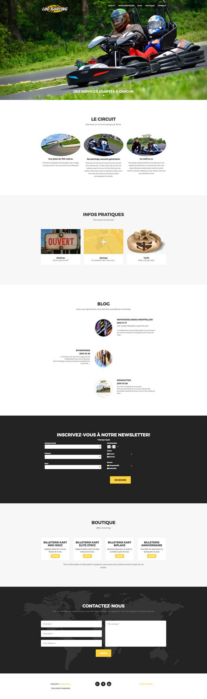

# Lockarting

> Vous pouvez retrouver mon code en ligne sur  http://www.lockarting.fr

## Fait avec :

## Travail effectué
  * Refonte d'un site internet existant (2002)
  * Formulaire de contact
  * Blog
  * Mise en place d'une solution de vente de billeterie en ligne avec un widget weezevent
  * Gestion des newsletter avec Mailchimp

## Travail en cours
  * Refonte du blog avec mise en place de wordpress
  * Automatisation des posts entre Facebook et Wordpress grâce à IFTTT ou Zapier (a definir encore)
